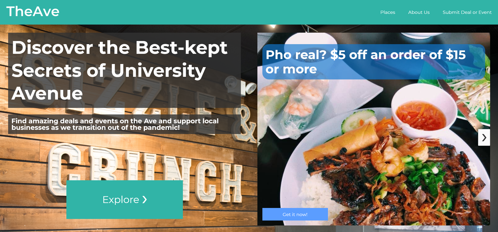

# Built for Dubhacks 2021

By Kevin Alfaro, Fatima Diallo, Karlee Wong, and Daniel Rashevsky

## Inspiration

We were looking to create something that could strengthen and uplift the bond between UW students and the surrounding community. TheAve allows students to interact more with surrounding businesses and gives businesses a chance to gain the exposure they may have lost due to the pandemic.

## What it does

TheAve is a community-building and events platform that allows small businesses and groups on The Ave in Seattle to collaborate and host events, giveaways, and deals to reforge bonds after the pandemic.

## What's in this repo

This repository contains the HTML-ized version of the Webflow site we built, alongside the CMS collections, design document, and screenshots of the live site.

## How we built it

We used LucidChart to diagram all of our site features. This translated directly into Webflow, which is a no-code website builder that allowed us to rapidly build, test, and deploy our platform. It included CMS, which powers our business and event tracking.

## Challenges we ran into

In general, we were a pretty agile and fast-paced team, but challenges we ran into included idea generation and not too much prior experience with webflow.

## Accomplishments that we're proud of

We are proud of the clean and functional website we created, and how rapidly we were able to design and build it. In the real world, this project could prove immensely useful in bringing community together on the Ave after the pandemic. 

## What we learned

We learned just how fast-paced a hackathon is, even requiring an all-nighter. We also learned a new tool, Webflow, and how beneficial a good group dynamic is to getting things done.

## What's next for TheAve

We hope to expand our services cover the whole Ave by marketing and talking to individual business owners, and make TheAve a platform of choice for fostering community in Seattle.

## More Links

Live site: [Link](https://theave-uw.webflow.io/)

Our demo video: [Link](https://www.youtube.com/watch?v=ftMBo4VZpsQ)

Cloneable Webflow Project: [Link](https://webflow.com/website/TheAve-Platform)

DevPost project page: [Link](https://devpost.com/software/theave)

Archived versions: [Archive.md](https://archive.md/584yV) and [Archive.org](https://web.archive.org/web/20211025000256/http://theave-uw.webflow.io/)
